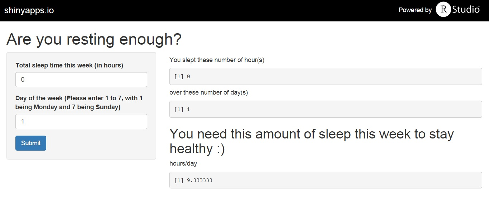

## Surprising health benefits of sleep

1. Improve memory
2. Live longer
3. Spur creativity
4. Sharpen attention
5. Steer clear of depression

Sleep makes you feel better, but its importance goes way beyond just boosting your mood or banishing under-eye circles. Adequate sleep is a key part of a healthy lifestyle, and can benefit your heart, weight, mind, and more.

Start keeping track on the amount of sleep everyday with "Sleep"!

source:http://www.health.com/health/gallery/thumbnails/0,,20459221,00.html

--- .class #id 

## Shiny App: Sleep

    

--- .class #id 

## Sleep: How it works

Magic number : EIGHT 8

Calculation used in Sleep is based on the assumption that 8 hours of sleep each night gives optimal benefits 

hoursNeeded=frac{(56-hours)}{(7-days)}

where

hours : number of sleep time this week

days : day of the week from 1 to 7 (1 being Monday and 7 being Sunday)

--- .class #id 

## Credits

IDA MOOC Pilot
Facilitator - Kai Xin

Start sleeping with Sleep!

https://epepqep.shinyapps.io/Sleep/

--- .class #id 

